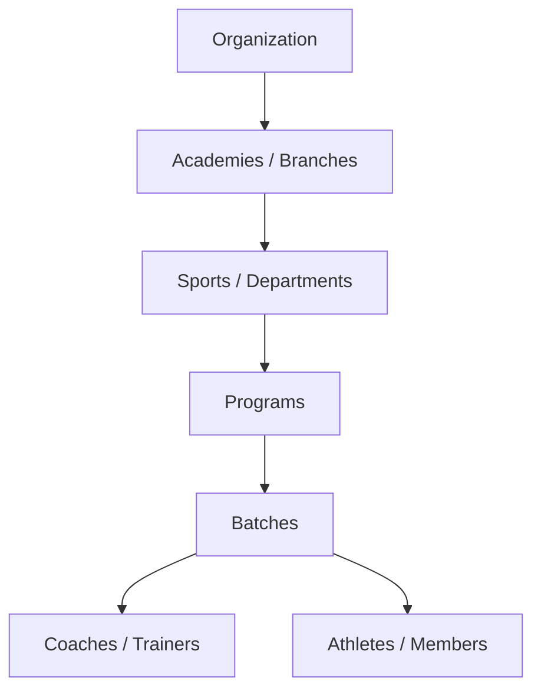

# 2. Architecture

## Core Hierarchy

`Organization → Academies / Branches → Sports / Departments → Programs → Batches →
Coaches / Trainers + Athletes / Members`

One organization can operate multiple academies. Every entity below Organization is scoped to
its parent, so data (attendance, performance, billing) always rolls up cleanly to an academy
and ultimately to the organization.

## User Roles

| Role | Scope |
|------|-------|
| Super Admin / Owner | Organization-wide control |
| Academy Manager | Manages a single academy/branch |
| Coach / Trainer | Runs batches: attendance, training, performance |
| Physician | Medical sessions and clearance status |
| Nutritionist | Nutrition plans and guidance |
| Receptionist | Front-desk: registration, payments, scheduling support |
| Athlete / Member | Own profile, schedule, performance, achievements |
| Parent / Guardian | View into a linked athlete's profile (Phase 2 dashboard) |

Permissions are role-based and data-sensitive: medical data in particular is
role-restricted (see [Product Rules](08-product-rules.md)).

---
[← Overview](01-overview.md) · [Next: Modules →](03-modules.md)
