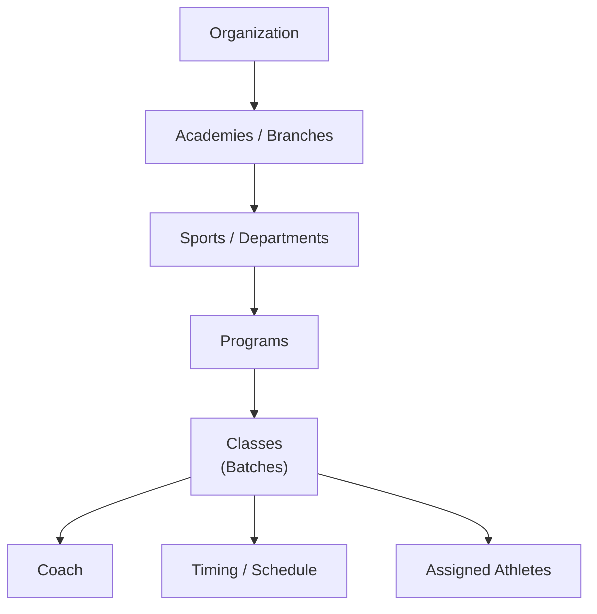
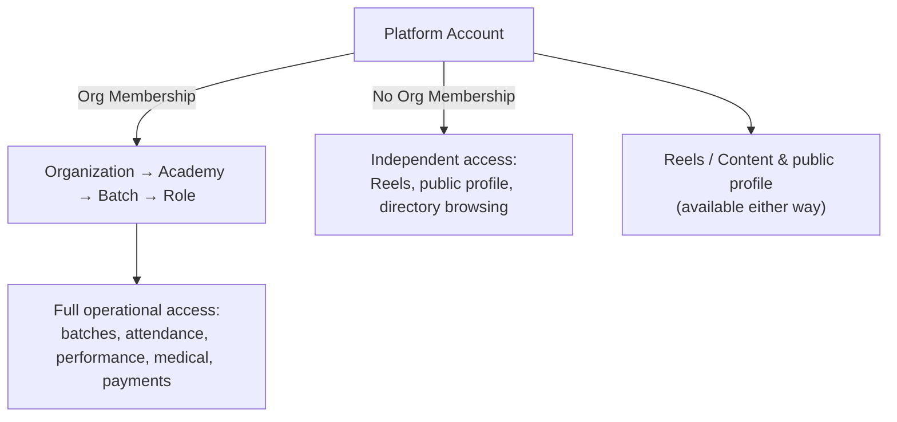

# 2. Architecture

## Multi-Tenancy: Organizations Register Too

The platform hosts **many** organizations, not one. Any business can self-register (see
[Organization Registration](#organization-registration) below) and gets its own isolated set of
academies, athletes, coaches, and data. A Super Admin/Owner belongs to one organization; nothing
they see or manage crosses into another org's data. The build ships two example organizations
(Elite Sports & Fitness, Apex Youth Sports) precisely to prove this isolation is real, not just a
relabeled screen.

## Core Hierarchy

`Organization → Academies / Branches → Sports / Departments → Programs → Classes (Batches) →
Coach + Timing + Assigned Athletes`

One organization can operate multiple academies. Every entity below Organization is scoped to
its parent, so data (attendance, performance, billing) always rolls up cleanly to an academy and
ultimately to the organization. "Batch" and "Class" name the same thing — the product surface
calls it a **Class** (Academy → Classes page), each with one coach, a timing string (e.g. "Mon /
Wed / Fri · 4:00 – 5:30 PM"), and a roster of assigned athletes that an Academy Manager can grow
over time.

## Organization Registration

A business owner fills in: organization name, one or more **categories** (multi-select, see
below), owner name/email/password, and an optional logo. Submitting creates the Organization and
signs the owner in as its Super Admin/Owner — see [Product Pages](06-product-pages.md) for the
page list and [Data Model](05-data-model.md#organization) for the stored fields.

## Academy Category

Both **Organizations** and **Academies** carry **categories: a multi-select list**, not a single
value — an academy (or a whole organization) can genuinely run more than one sport, and its
category list should say so directly instead of falling back to a vague "Multi-Sport" catch-all.
This is separate from the Sports/Departments layer in the hierarchy above:

- **Categories** are the classification used for branding, search/filtering on the public site
  (Academy Directory, Programs page, Coaches directory), and reporting (e.g. athlete count by
  category). Each carries its own icon, shown wherever the category appears (badges, filter
  bars, the create-academy/register-organization multi-select).
- **Sports/Departments** is the operational layer underneath the academy that actually defines
  which sports/programs it runs.

For a single-sport academy the two line up (a "Cricket Academy" has just `Cricket` selected). For
an academy that runs several sports, its category list holds each one directly (e.g.
`[Basketball, Athletics, Fitness & Gym]`) — `Multi-Sport` remains available as its own category
for a program/coach/athlete whose training is genuinely cross-sport rather than tied to one
listed sport.

| Category | Icon theme |
|---|---|
| Football | Ball with panel seams |
| Cricket | Bat and ball |
| Basketball | Ball with seam lines |
| Tennis | Racket |
| Swimming | Waves |
| Athletics | Track lanes |
| Martial Arts | Belt |
| Fitness & Gym | Dumbbell |
| Multi-Sport | Overlapping circles |

Categories are set when an organization or academy is created (multi-select, at least one
required) and can be changed later by an Academy Manager or Super Admin; changing them does not
affect existing athlete, program, or class data.

## Identity & Membership Model

The blueprint's role list (below) describes *what a user can do*, but the original hierarchy
implicitly assumes every user belongs to exactly one organization. That assumption breaks for
[independent coaches](flows/independent-coach-flow.md) and for anyone who works across academies,
so identity is split into two layers:

- **Platform Account** — the base identity every user has: login credentials, profile, avatar,
  and their own content (e.g. [Reels](flows/reels-flow.md)). Created once at registration and
  never duplicated afterward.
- **Org Membership** — a role binding that grants a Platform Account a role (Coach, Athlete,
  Physician, ...) *within* a specific Organization/Academy. A Platform Account can hold **zero**,
  one, or several Org Memberships.

A Platform Account with **zero** Org Memberships is an **independent user** — today this applies
to **Independent Coaches** (see [Independent Coach Flow](flows/independent-coach-flow.md)). They
use the platform's community features until they join, or are invited into, an academy — which
adds an Org Membership to their existing account rather than creating a second one. This
generalizes the existing "athlete is never duplicated on transfer" rule to identity itself (see
[Product Rules](08-product-rules.md)).

**UI-build note (no auth yet):** since there's no real login, the M0–M9 build simulates "who you
are" with a **persona preview** — the profile menu's role switcher additionally lets you pick
*which* coach or athlete you're previewing as, not just the role label. Content authorship
(Reels), "My Classes," and "My Athletes" all key off this persona. It's a stand-in for a real
Org Membership session and should be replaced by real per-account auth at M10, not treated as the
final identity model.

## User Roles

| Role | Scope |
|------|-------|
| Super Admin / Owner | Full control of the one organization they registered or were granted — never another org's data |
| Academy Manager | Manages a single academy/branch |
| Coach / Trainer | Runs batches: attendance, training, performance. Can also exist **independently**, with no Org Membership — see [Identity & Membership Model](#identity--membership-model) |
| Physician | Medical sessions and clearance status |
| Nutritionist | Nutrition plans and guidance |
| Receptionist | Front-desk: registration, payments, scheduling support |
| Athlete / Member | Own profile, schedule, performance, achievements |
| Parent / Guardian | View into a linked athlete's profile (Phase 2 dashboard) |

Permissions are role-based and data-sensitive: medical data in particular is
role-restricted (see [Product Rules](08-product-rules.md)).

Coach/Trainer, Athlete/Member, and Physician can additionally post and watch
[Reels](flows/reels-flow.md); see that flow for role-specific content rules.

---
[← Overview](01-overview.md) · [Next: Modules →](03-modules.md)
