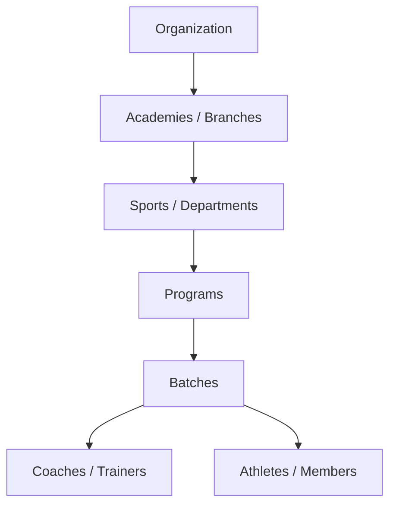
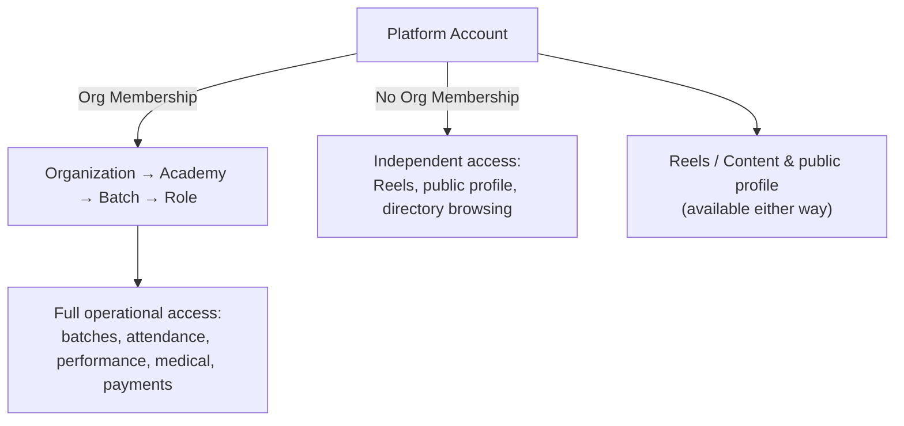

# 2. Architecture

## Core Hierarchy

`Organization → Academies / Branches → Sports / Departments → Programs → Batches →
Coaches / Trainers + Athletes / Members`

One organization can operate multiple academies. Every entity below Organization is scoped to
its parent, so data (attendance, performance, billing) always rolls up cleanly to an academy
and ultimately to the organization.

## Academy Category

Each academy carries a **category** — a single classification attribute answering "what kind
of academy is this?" (e.g. Football Academy, Cricket Academy). This is separate from the
Sports/Departments layer in the hierarchy above:

- **Category** is the academy's primary classification, used for branding, search/filtering on
  the public site (Academy Directory, Programs page), and reporting (e.g. revenue or athlete
  count by category).
- **Sports/Departments** is the operational layer underneath the academy that actually defines
  which sports/programs it runs.

For a single-sport academy the two line up (a "Cricket Academy" runs a Cricket department). For
an academy that runs several sports, category is set to `Multi-Sport` while its
Sports/Departments layer still lists each sport individually — no data is lost either way.

| Example categories |
|---|
| Football Academy |
| Cricket Academy |
| Basketball Academy |
| Tennis Academy |
| Swimming Academy |
| Athletics / Track & Field Academy |
| Martial Arts Academy |
| Fitness & Gym |
| Multi-Sport Academy |

Category is set when an academy is created and can be changed by an Academy Manager or Super
Admin; it does not affect existing athlete, program, or batch data.

## Identity & Membership Model

The blueprint's role list (below) describes *what a user can do*, but the original hierarchy
implicitly assumes every user belongs to exactly one organization. That assumption breaks for
[independent coaches](flows/independent-coach-flow.md) and for anyone who works across academies,
so identity is split into two layers:

- **Platform Account** — the base identity every user has: login credentials, profile, avatar,
  and their own content (e.g. [Reels](flows/reels-flow.md)). Created once at registration and
  never duplicated afterward.
- **Org Membership** — a role binding that grants a Platform Account a role (Coach, Athlete,
  Physician, ...) *within* a specific Organization/Academy. A Platform Account can hold **zero**,
  one, or several Org Memberships.

A Platform Account with **zero** Org Memberships is an **independent user** — today this applies
to **Independent Coaches** (see [Independent Coach Flow](flows/independent-coach-flow.md)). They
use the platform's community features until they join, or are invited into, an academy — which
adds an Org Membership to their existing account rather than creating a second one. This
generalizes the existing "athlete is never duplicated on transfer" rule to identity itself (see
[Product Rules](08-product-rules.md)).

## User Roles

| Role | Scope |
|------|-------|
| Super Admin / Owner | Organization-wide control |
| Academy Manager | Manages a single academy/branch |
| Coach / Trainer | Runs batches: attendance, training, performance. Can also exist **independently**, with no Org Membership — see [Identity & Membership Model](#identity--membership-model) |
| Physician | Medical sessions and clearance status |
| Nutritionist | Nutrition plans and guidance |
| Receptionist | Front-desk: registration, payments, scheduling support |
| Athlete / Member | Own profile, schedule, performance, achievements |
| Parent / Guardian | View into a linked athlete's profile (Phase 2 dashboard) |

Permissions are role-based and data-sensitive: medical data in particular is
role-restricted (see [Product Rules](08-product-rules.md)).

Coach/Trainer, Athlete/Member, and Physician can additionally post and watch
[Reels](flows/reels-flow.md); see that flow for role-specific content rules.

---
[← Overview](01-overview.md) · [Next: Modules →](03-modules.md)
