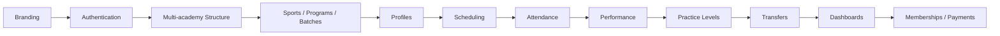

# 7. Roadmap

## MVP Development Order

1. Branding
2. Authentication
3. Multi-academy structure
4. Sports/Programs/Batches
5. Profiles
6. Scheduling
7. Attendance
8. Performance
9. Practice Levels
10. Transfers
11. Dashboards
12. Memberships/Payments

## Phase 2

Deferred to after MVP:

- Physician portal
- Nutritionist portal
- Parent dashboard
- Tournament management
- QR check-in
- Advanced analytics
- Notifications
- Certificates

---
[← Product Pages](06-product-pages.md) · [Next: Product Rules →](08-product-rules.md)
