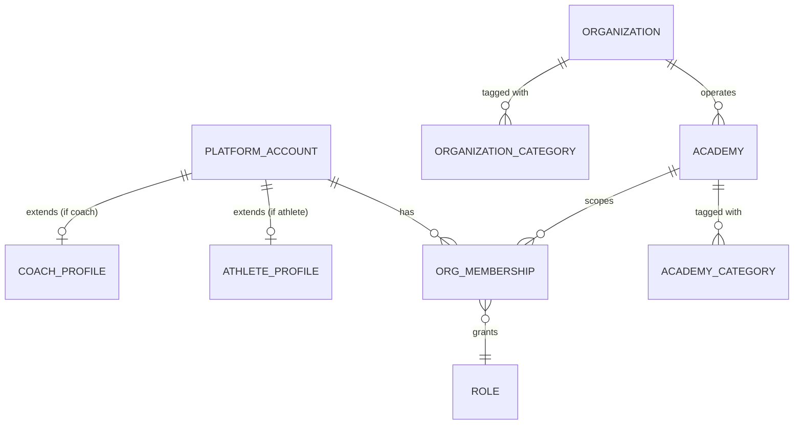
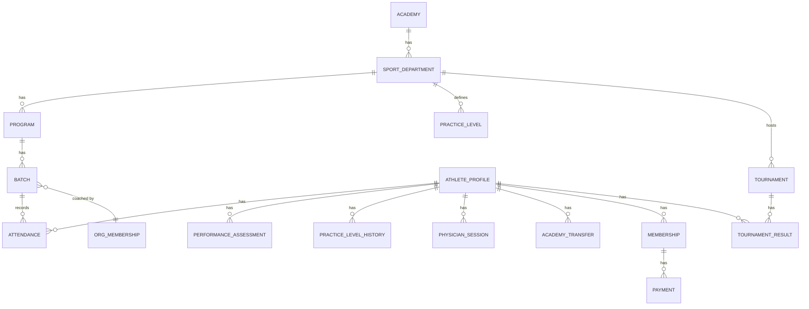
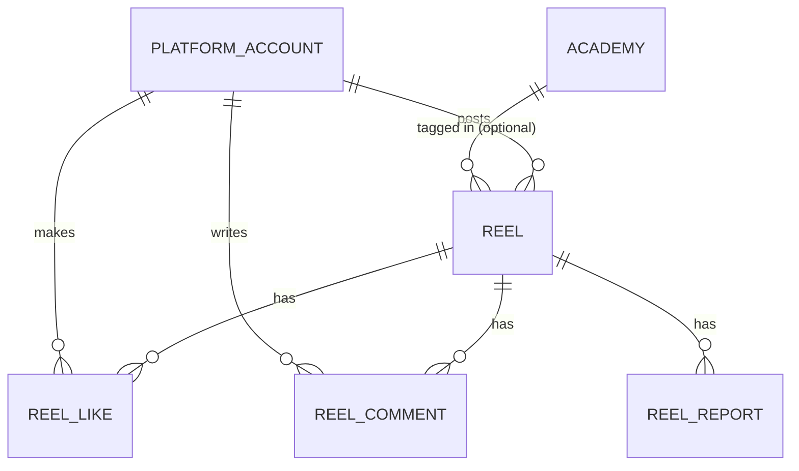

# 11. Database Schema

Reference schema for [M11: Database Implementation](10-milestones.md) — not implemented yet.
This documents the entities implied by the [Data Model](05-data-model.md) and the flow docs so
backend work has a target. Field lists are the columns that matter for design review, not final
DDL (types/indexes get finalized during M10/M11).

## Identity & Membership

| Entity | Key fields |
|--------|-----------|
| `platform_account` | id, name, email, phone, password_hash, avatar_url, created_at |
| `organization` | id, name, slug, logo_url, owner_platform_account_id, created_at — see [Organization Registration](02-architecture.md#organization-registration) |
| `organization_category` | organization_id, category ([Academy Category](02-architecture.md#academy-category)) — join table, multi-select |
| `academy` | id, organization_id, name, branch, image_url, lat, lng, created_at |
| `academy_category` | academy_id, category ([Academy Category](02-architecture.md#academy-category)) — join table, multi-select (see [Academy](05-data-model.md#academy)) |
| `org_membership` | id, platform_account_id, academy_id, role (`role` enum), status (Active/Invited/Removed), joined_at |
| `role` | id, name (Super Admin, Academy Manager, Coach/Trainer, Physician, Nutritionist, Receptionist, Athlete/Member, Parent/Guardian) |

An account with **zero** `org_membership` rows is an independent user (see
[Identity & Membership Model](02-architecture.md#identity--membership-model)). Every `academy`
row belongs to exactly one `organization` — that FK is the entire multi-tenant boundary; every
query scoped "for this org" is a join through it.

## Sports Structure & Athlete Operations

| Entity | Key fields |
|--------|-----------|
| `sport_department` | id, academy_id, name |
| `program` | id, sport_department_id, name, description |
| `batch` | id, program_id, name, schedule, coach_membership_id — called a **Class** in the product (Academy → Classes page); `schedule` is the free-text timing shown there |
| `athlete_profile` | id, platform_account_id, guardian_name, guardian_contact, current_academy_id, current_program_id, current_batch_id, status |
| `attendance` | id, batch_id, athlete_id, session_date, status (Present/Absent/Late/Excused), marked_by, created_at — see [Attendance Flow](flows/attendance-flow.md) |
| `performance_assessment` | id, athlete_id, coach_membership_id, date, metrics (JSON: sport-specific skills + fitness), feedback, recommended_level_id, created_at — append-only, see [Performance Flow](flows/performance-flow.md) |
| `practice_level` | id, sport_department_id, level_number (1-5), name, promotion_criteria |
| `practice_level_history` | id, athlete_id, practice_level_id, promoted_at, promoted_by — append-only |
| `physician_session` | id, athlete_id, physician_membership_id, date, assessment, recommendations, training_status (Cleared/Restricted/Temporarily Not Cleared), follow_up_date — see [Physician Session Flow](flows/physician-session-flow.md) |
| `academy_transfer` | id, athlete_id, source_academy_id, destination_academy_id, transfer_date, reason, status, approved_by — see [Academy Transfer Flow](flows/academy-transfer-flow.md) |
| `membership` | id, athlete_id, plan_name, price, start_date, end_date, status |
| `payment` | id, membership_id, amount, paid_at, method, status |
| `tournament` | id, sport_department_id, name, start_date, end_date, location |
| `tournament_result` | id, tournament_id, athlete_id, result, achievement |

## Content: Reels

| Entity | Key fields |
|--------|-----------|
| `reel` | id, author_platform_account_id, video_url, thumbnail_url, caption, tags (array), academy_id (nullable), visibility (Public/Academy-only), status (Published/In Review/Removed), view_count, created_at — see [Reels Flow](flows/reels-flow.md) |
| `reel_like` | id, reel_id, platform_account_id, created_at |
| `reel_comment` | id, reel_id, platform_account_id, text, created_at |
| `reel_report` | id, reel_id, reported_by, reason, status (Open/Reviewed), reviewed_by |

## Cross-cutting

| Entity | Key fields |
|--------|-----------|
| `notification` | id, platform_account_id, type, payload (JSON), read_at, created_at |
| `audit_log` | id, actor_platform_account_id, action, entity_type, entity_id, metadata (JSON), created_at — see [audit trail rule](08-product-rules.md) |

## Notes for M11

- `athlete_profile` and `coach_profile` both extend `platform_account` 1:0..1 — a single account
  table backs every role, per the [Identity & Membership Model](02-architecture.md#identity--membership-model).
- `performance_assessment`, `practice_level_history`, and `academy_transfer` are append-only —
  never update rows in place, per [Product Rules](08-product-rules.md).
- Medical fields (`physician_session`) need row-level access control restricted to Physician +
  explicitly authorized roles, not just application-layer hiding.
- The M0–M9 UI build stores every `*_url` field (avatar, academy `image_url`, organization
  `logo_url`) as an in-browser base64 data URI — there is no object storage yet. M11 should swap
  these for real uploads to blob storage (S3-compatible) with the DB column holding the resulting
  URL, not the image bytes.
- `organization_category` / `academy_category` are genuine many-to-many join tables now that
  organizations and academies both support multiple categories — don't collapse them back to a
  single enum column.

---
[← Milestones](10-milestones.md) · [Back to index](README.md)
