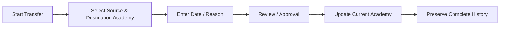

# Academy Transfer Flow

**The athlete is never duplicated.** A transfer updates the athlete's current academy while
retaining every prior attendance, performance, and medical record under the same athlete
record — visible via the profile's Transfer History section (see
[Data Model](../05-data-model.md)).

---
[← Physician Session Flow](physician-session-flow.md) · [Back to index](../README.md)
