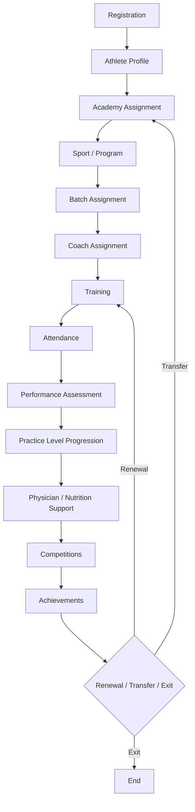

# Athlete Lifecycle

The end-to-end journey of an athlete through the platform, tying together every module.

1. **Registration** — athlete signs up (self, guardian, or receptionist-assisted).
2. **Athlete Profile** — profile created; see [Data Model](../05-data-model.md) for sections.
3. **Academy Assignment** — athlete assigned to an academy/branch.
4. **Sport/Program** — athlete enrolled into a sport and program.
5. **Batch Assignment** — placed into a scheduled batch.
6. **Coach Assignment** — batch's coach becomes the athlete's coach.
7. **Training** — ongoing training per the batch's training plan.
8. **Attendance** — tracked per session; see [Attendance Flow](attendance-flow.md).
9. **Performance Assessment** — periodic assessments; see [Performance Flow](performance-flow.md).
10. **Practice Level Progression** — level promotions based on assessment recommendations; see
    [Practice Levels](../05-data-model.md#practice-levels).
11. **Physician/Nutrition Support** — as needed; see [Physician Session Flow](physician-session-flow.md).
12. **Competitions** — tournament participation.
13. **Achievements** — results and awards recorded on the profile.
14. **Renewal / Transfer / Exit** — the athlete renews (loops back into training), transfers to
    another academy (see [Academy Transfer Flow](academy-transfer-flow.md)), or exits the
    platform. Full history is always preserved.

---
[← Modules](../03-modules.md) · [Next: Attendance Flow →](attendance-flow.md)
