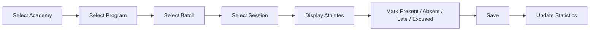

# Attendance Flow

Attendance is **session-based**: each recorded entry belongs to a specific session of a
specific batch, not a generic daily log. This keeps attendance statistics accurate across
batches that meet multiple times per week.

Status options: `Present`, `Absent`, `Late`, `Excused`.

---
[← Athlete Lifecycle](athlete-lifecycle.md) · [Next: Performance Flow →](performance-flow.md)
