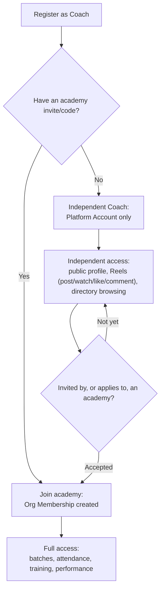

# Independent Coach Flow

A coach can join the platform without belonging to any organization or academy, and later
upgrade to a full academy-affiliated coach without losing anything they've already built — their
Platform Account is never duplicated (see [Identity & Membership Model](../02-architecture.md#identity--membership-model)).

## What an independent coach can do

- Create and edit a public Coach Profile (bio, sport specialties, certifications, location,
  social links) — see [Data Model](../05-data-model.md#coach-profile-sections).
- Post, watch, like, and comment on [Reels](reels-flow.md).
- Browse the public Programs page and Academy Directory.
- Apply to, or accept an invite from, an academy.

## What an independent coach cannot do

Until they hold an Org Membership, they cannot:

- Access any academy's batches, attendance, or scheduling.
- Create athlete performance assessments.
- View any athlete's medical or practice-level data.
- Appear on an academy's official Coach Dashboard or payroll/payments.

## Upgrade path

When an independent coach joins an academy — via invite from an Academy Manager, or by applying
and being approved — an Org Membership is created linking their existing Platform Account to
that academy with the Coach/Trainer role. Their Reels, engagement history, and public profile
carry over unchanged; no new account is created (see [Product Rules](../08-product-rules.md)).

---
[← Reels Flow](reels-flow.md) · [Back to index](../README.md)
