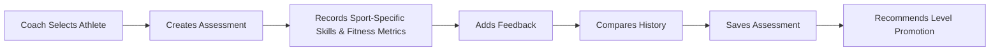

# Performance Flow

Assessments are **historical** — every assessment is retained as an immutable record so
progress can be compared over time, not overwritten (see
[Product Rules](../08-product-rules.md)). A completed assessment can recommend a
[practice level](../05-data-model.md#practice-levels) promotion.

---
[← Attendance Flow](attendance-flow.md) · [Next: Physician Session Flow →](physician-session-flow.md)
