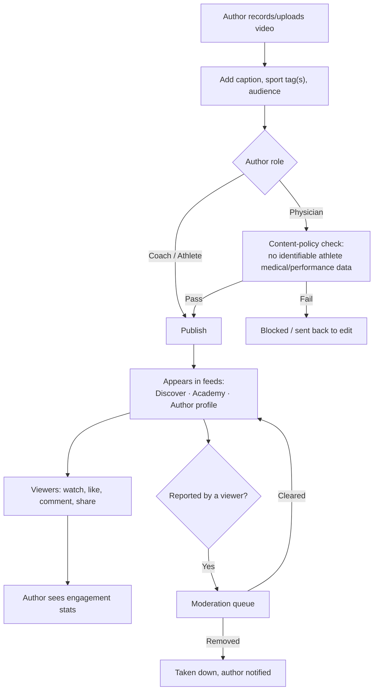

# Reels Flow

Short-form video posting for engagement, coaching tips, highlights, and personal branding —
open to Coaches (academy-affiliated or independent), Athletes, and Physicians.

## Who can post

| Role | Typical content |
|------|------------------|
| Coach / Trainer | Drills, tips, academy promo. Works the same whether academy-affiliated or [independent](independent-coach-flow.md) |
| Athlete / Member | Training clips, competition highlights, achievements |
| Physician | General wellness / injury-prevention / recovery content only |

Physicians must never post content that references an identifiable athlete's medical record or
performance data without that athlete's (or guardian's) explicit consent — this extends the
platform's existing medical-data role-restriction into the content layer (see
[Product Rules](../08-product-rules.md)).

## Reel attributes

Author, video, thumbnail, caption, sport/hashtag tags, optional academy tag, visibility
(Public or Academy-only — Academy-only only applies to academy-affiliated authors), status
(Published / In Review / Removed), like count, comment count, view count, created date. See
[Data Model](../05-data-model.md#reel) for the full field table.

## Feeds

| Feed | Shows |
|------|-------|
| Discover | All public Reels platform-wide, ranked by recency/engagement |
| Academy | Reels tagged to one academy — shown on that academy's public page |
| Profile | One author's own Reels — shown on their Coach/Athlete/Physician profile |

## Moderation

Any viewer can report a Reel or comment. Reports route to a moderation queue:

- **Academy-affiliated content** → that academy's Manager, or Super Admin.
- **Independent coach content** → Super Admin — independent users have no Academy Manager, so
  platform-level moderation falls to the org's Super Admin (see
  [Architecture Review](../09-architecture-review.md)).

---
[← Academy Transfer Flow](academy-transfer-flow.md) · [Next: Independent Coach Flow →](independent-coach-flow.md)
